# 들어가며

> 프론트엔드 기술에 대한 오픈소스 기여 이야기지만, 분야를 넘어서 오픈소스 전체적인 생태계에 관한 이야기예요.

저는 지금까지 `suspensive`, `@tanstack/query`, `pnpm` 등 다양한 오픈소스 프로젝트에 기여하고 개발하는 활동을 해왔어요. 이러한 저의 경험을 바탕으로 오픈소스 활동을 왜 시작하게 되었는지, 오픈소스가 무엇인지 그리고 어떻게 기여할 수 있는지 등 오픈소스 생태계에 대한 이야기를 여러분과 나누고자 합니다.

해당 글을 통해 한 번도 기여를 해본 적이 없는 분들에게는 관심과 용기를 드리고 싶고, 기존에 기여를 해본 적이 있는 분들에게는 저의 경험과 노하우를 공유하고자 해요. 여러분의 오픈소스 여정을 시작하거나 발전시키는 데 인사이트를 얻는 시간이 되었으면 좋겠습니다.

# 오픈소스가 뭔가요?

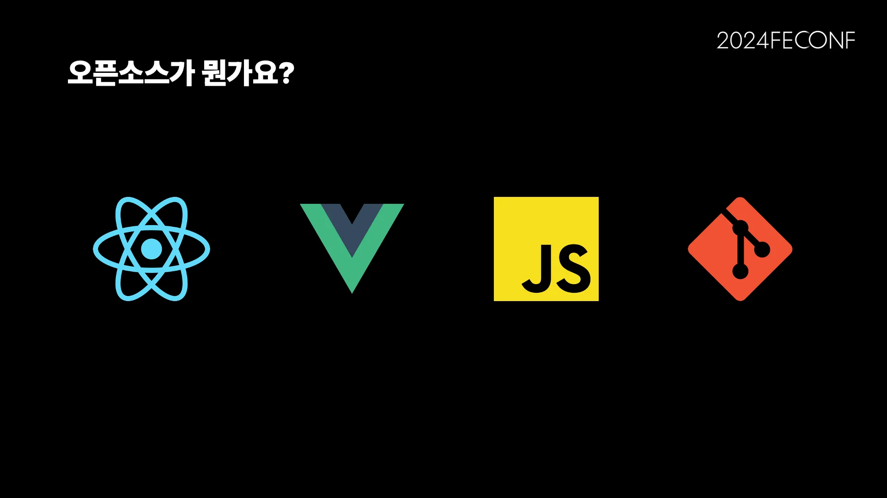

본격적으로 제 경험을 이야기하기 전에, 먼저 오픈소스가 무엇인지부터 간단하게 살펴볼 거예요.

우리가 웹을 개발을 할 때, 어떤 기술을 사용하는지 한번 떠올려 볼까요? 대부분의 프론트엔드 개발자라면 `React`나 `Vue` 와 같은 라이브러리를 떠올릴 것입니다. 요즘은 `Next.js`도 빠질 수 없죠. 프론트엔드 기술을 넘어, 개발을 구성하는 요소들 `JavaScript`와 같은 프로그래밍 언어, 버전 관리를 위해 사용하는 `Git`도 빠질 수 없습니다. 이 모든 것들이 우리 개발 환경의 중요한 부분을 차지하고 있죠.

우리가 일상적으로 사용하고 있는 이 기술들은 모두 오픈소스입니다. 여기서 오픈소스란, 소프트웨어의 소스 코드가 공개되어 있어 누구나 접근하고, 이를 활용해 개발하거나 수정하고 배포할 수 있는 소프트웨어(코드)를 말해요. 즉, 우리는 공개된 기술을 활용해 개발을 하고 있는 셈입니다.

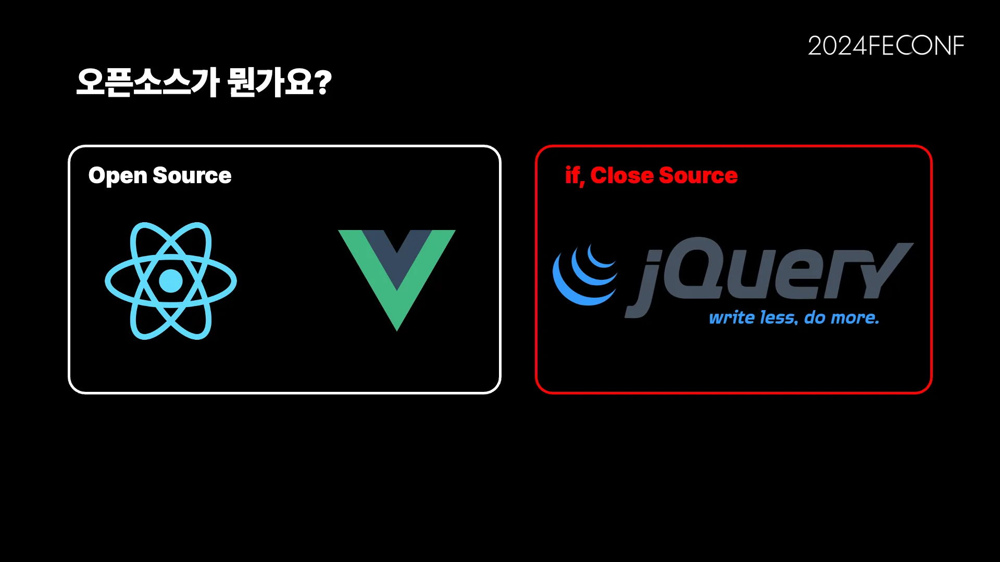

한 번 상상해 볼까요? 만약 우리가 사용하는 오픈소스 소프트웨어가 비공개(Closed)였다면 어땠을까요? `React`나 `Vue`가 존재하지 않는 세상이라면, 우리는 여전히 `JQuery`를 사용하고 있을지도 모릅니다. 그런데 만약 `JQuery` 조차 오픈소스가 아니었다면, 특정 회사가 라이센스를 독점하고 있었다면 지금의 기술 발전이 있었을까요? 아마도 현재의 모습과는 많이 다른 모습일 것 같아요. 이처럼 프론트엔드 기술은 오픈소스 생태계를 통해 발전을 이뤘다고 생각해요.

# 오픈소스 기여 방법

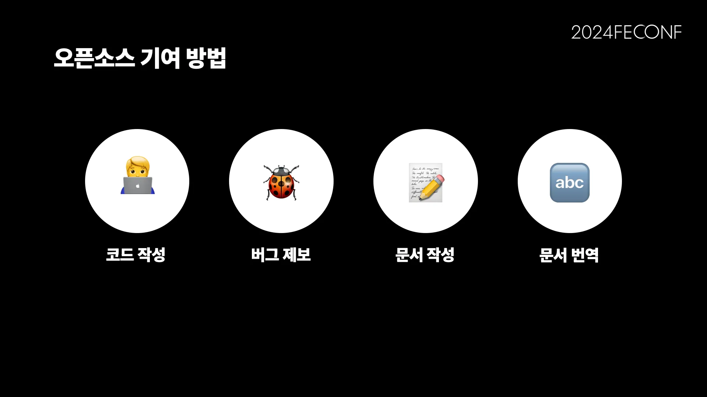

오픈소스가 뭔지 간단하게 알아봤는데요, 다음으로는 오픈소스 기여는 어떤 것인지 간단하게 살펴볼 거예요.

오픈소스 기여란 오픈소스 프로젝트의 발전과 개선을 위해 다양한 방식으로 참여하고 도움을 주는 활동을 말해요. 이 기여는 단순히 코드 작성에만 국한되지 않고, 문서 작성, 오류 보고, 번역 등 여러 가지 형태로 이뤄질 수 있어요.

오픈소스 기여라는 말을 들으면 흔히 복잡한 작업이나 시간이 많이 걸리는 큰 작업을 떠올리기 쉬워요. 물론 그런 기여도 중요하지만, 오픈소스에 기여할 수 있는 방법은 생각보다 훨씬 다양하고 간단할 수 있어요. 오타를 수정하는 것, 문서를 더 이해하기 쉽게 개선하는 것, 다양한 사용자들이 읽을 수 있도록 번역하는 것 등 이 모든 것들이 중요한 기여예요.

# 오픈소스를 기여한 2가지 경험

앞서 말씀드렸듯이, 오픈소스에 기여하는 방법은 매우 다양해요. 여러분들에게 이야기하며 기여 과정에 대해 알아볼 2개의 오픈소스 기여 경험을 가져왔어요.

첫 번째, 오픈소스 메인테이너(Maintainer)에게 새로운 기능을 제안하여 설득하고 기여한 경험이고, 두 번째는 개발 중에 발견한 버그를 개선하고 기여한 경험이에요.

## 첫 번째, 새로운 기능을 제안하여 기여한 경험

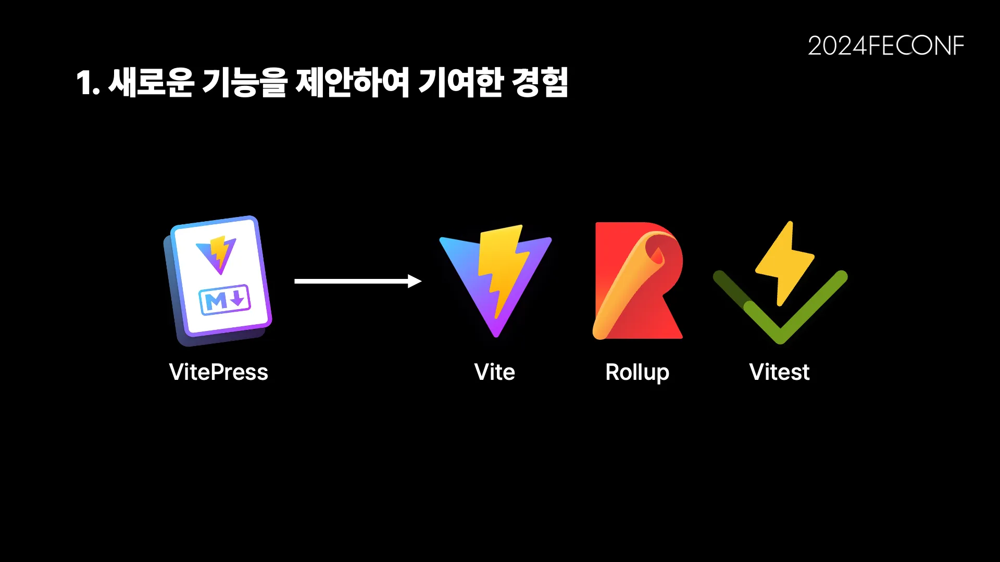

저는 라이브러리를 만들고 문서화할 때 주로 `VitePress`를 사용해요. `VitePress`는 `Vue` 기반으로 정적 문서를 생성하는 프레임워크로 `Vite`, `Rollup` 등 여러 규모 있는 라이브러리에서 공식 문서 작성에 활용되는 프레임워크이에요.

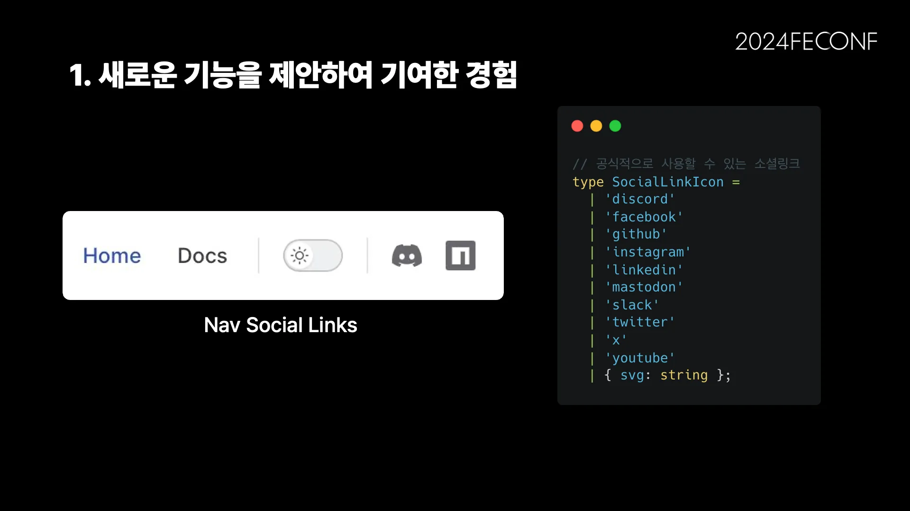

제가 개발하는 라이브러리들은 항상 NPM을 통해 배포되었기 때문에, 문서의 Nav Social Links에 NPM 링크를 추가하고자 했어요. 그런데 discord, facebook, github, instagram 등 다양한 소셜 링크 옵션이 제공되고 있었지만, NPM 링크는 없다는 사실을 알게 됐어요. `VitePress`가 주로 라이브러리 공식 문서로 사용된다는 점에서 NPM 링크가 없다는 것은 불편한 일이었죠.

물론, 커스텀 기능을 이용해 NPM 로고 이미지를 삽입하는 방법이 있긴 해요. 그러나 이 방식은 번거로워요. 라이브러리를 개발할 때마다 NPM 로고를 커스텀으로 추가하는 작업을 반복해야 했기 때문이에요. 그래서 저는 이 문제를 해결하기 위해 직접 기여를 해보기로 결심했어요.

> 이처럼 분명 라이브러리를 사용하면서 불편한 점 혹은 개선하면 좋은 점이 있을거예요, 어려분들도 말이죠.

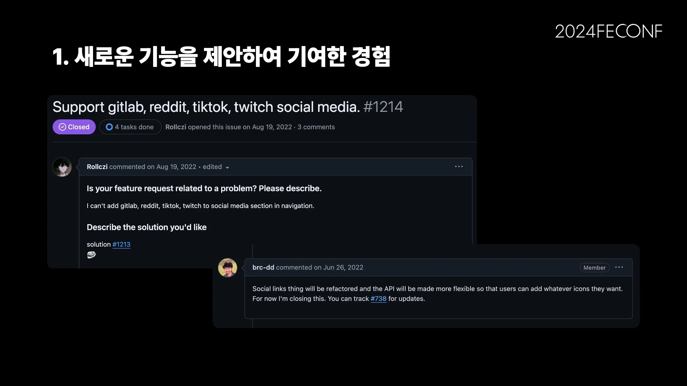

하지만, 저와 같은 생각을 가진 다른 개발자들도 이미 비슷한 시도를 했다는 것을 알게 됐어요. NPM뿐만 아니라 GitLab, Reddit, TikTok 등 다른 소셜 링크도 추가하려는 시도가 있었지만, 메인테이너가 이를 거절한 이력이 있어요. 메인테이너는 커스텀 기능을 통해 이러한 요구를 충족시킬 수 있다고 판단해 새로운 소셜 링크를 추가하지 않기로 결정했던 거예요.

그럼에도 불구하고, 저는 NPM이 다른 소셜 링크와는 다르다고 생각을 했어요. NPM은 단순한 소셜 링크가 아니라, 대부분의 라이브러리가 배포되는 플랫폼으로 사용자들에게 실질적인 가치 혹은 사용성을 제공할 수 있다고 생각했어요. 그래서 저는 포기하지 않고 Github Issue를 생성해 NPM 테마가 왜 필요한지에 대해 논리적으로 설득하고자 했어요.

> 이처럼 불편한 점 혹은 개선하고자 하는 점을 제보, 제기하는 것으로 시작됩니다.

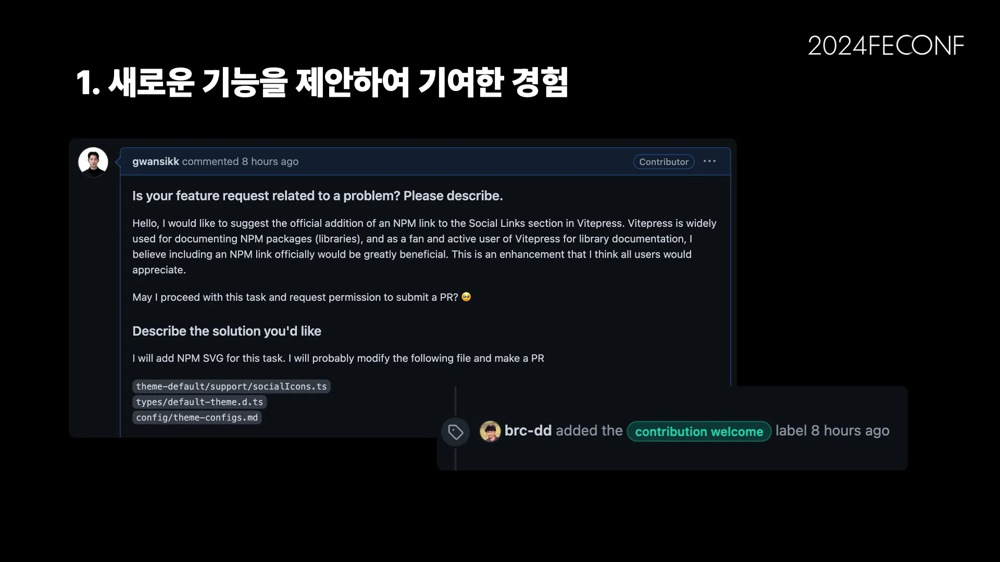

해당 이슈에는 “대부분의 NPM 패키지(라이브러리)를 문서화하는데 널리 사용되고 있으며, NPM을 공식적으로 포함하면 사용자 모두에게 큰 도움이 될 것이라고 생각합니다.“라는 핵심 메시지를 담았습니다. 또한, 이 작업을 어떻게 진행할 것인지에 대해 설명했어요.

결국, 저의 요청은 받아들여졌고, `contribution welcome` 라벨이 달린 이슈로 승인을 받게 되었습니다. 비록 메인테이너가 처음에는 추가 소셜 링크 옵션을 더 이상 받지 않겠다고 했지만, NPM의 중요성을 강조하며 이슈를 생성한 결과, 설득할 수 있었고 기여를 할 수 있었어요.

이처럼 라이브러리를 사용하면서 불편한점 개선 점을 발견해보신적이 있으실 거에요

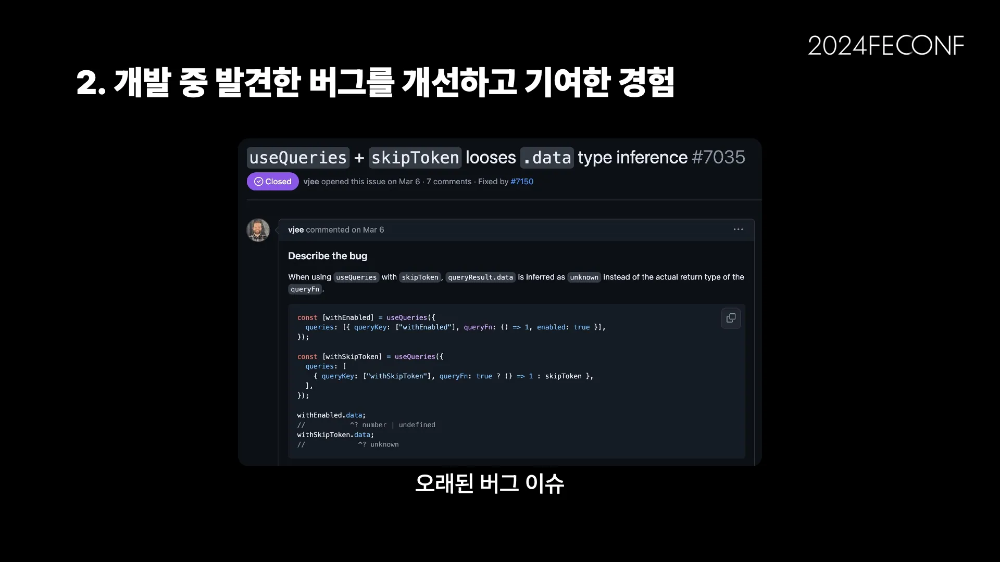

> 해당 경험을 통해서 자신있게, 의견을 논리적으로 전달하고 도전하는 것

이 경험은 포기하지 않고 자신의 의견을 논리적으로 전달하는 것이 얼마나 중요한지 깨닫게 해주었습니다. 작은 불편에서 시작된 기여가 많은 사용자들에게 실질적인 도움이 될 수 있다는 것을 알게 되었고, 이는 오픈소스 기여의 큰 보람 중 하나라고 생각합니다.

## 두 번째, 개발 중 발견한 버그를 개선하고 기여한 경험

> 문제를 해결에 필요한 정보(힌트) 찾기

여러분도 개발 중 의도하지 않은 버그가 발생해 트러블 슈팅을 하다, 라이브러리 자체에서 발생하는 버그임을 발견한 경험이 있을거예요. 큰 규모의 라이브러리도 이런 버그가 있기 마련인데요, 저 역시 TanStack Query를 사용하면서 버그를 마주치게 되었고, 이를 개선해 기여했던 경험이 있어요.

이 버그는 동아리 프로젝트에서 TanStack Query의 `useQueries`를 사용해 어드민 페이지를 개발하던 중 발견하게 되었어요.

```ts
// 일정을 조회합니다.
export const useSchedule = ({ isNotAdmin }: UseScheduleParams) => {
  return useQueries({
    queries: [
      {
        queryKey: QUERY_KEY.SCHEDULE,
        queryFn: () => getSchedule, // is Data
      },
      {
        // 해당 일정 정보는 어드민에게만 제공 됩니다.
        queryKey: QUERY_KEY.NOTICE.ADMIN,
        queryFn: isNotAdmin
          ? skipToken // 어드민이 아닐 경우 해당 쿼리를 비활성화
          : () => getAdminSchedule(), // is unknown
      },
    ],
  });
};
```

위 코드는 운영진(어드민)에게만 일정 정보를 보여주기 위해 `skipToken`을 사용해 데이터를 조건부로 가져오도록 분기처리한 코드예요. 그러나 `useQueries`에서 `skipToken`을 사용하면 반환되는 데이터의 타입이 `unknown`으로 추론되는 문제가 발생했어요.

> 라이브러리 버그로 의심을 안했을때 디버깅하는 엄청난 시간을 소모했습니다. 규모 있는 라이브러리라도 의심이 필요해요

다른 훅에서도 비슷한 문제가 발생하는 것을 확인하고 디버깅한 결과, `skipToken`을 사용할 때 이런 문제가 생긴다는 결론에 이르렀습니다. 처음에는 제가 `useQueries`를 잘못 사용한 것이 아닌가 싶어 살펴보았지만, 문제점을 파악할 수 없었어요. 이로인해 엄청난 시간이 소요됐어요.

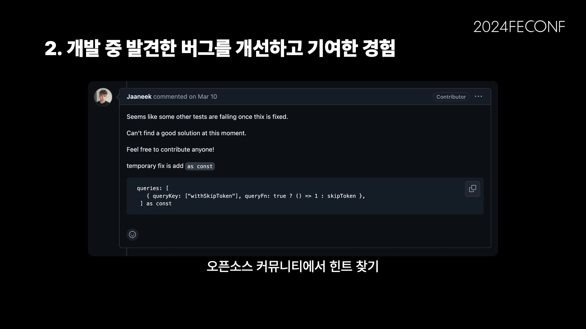

많은 시간을 사용해서야 버그로 의심하게 되었고, 확인하기 위해 GitHub Issue를 살펴봤어요. 3월 6일, 이미 이 버그가 다른 개발자에 의해 보고된 상태였다는 것을 확인할 수 있었습니다. 이제 문제점을 파악하여 `skipToken`을 사용하지 않고 다른 방법으로 해결하게 됐어요.

하지만, 여기서 끝내면 저의 문제만 임시적으로 해결한거에요, 해당 라이브러리를 사용하는 사용자 모두가 겪을 수 있고, 개선 필요성을 느꼈어요.

로컬 환경에 프로젝트를 설정하고 코드를 열어본 순간, 방대한 코드와 프로젝트 규모에 깜짝 놀랐습니다. 이 오픈소스 프로젝트는 수많은 패키지가 모노레포(Monorepo)로 구성되어 있었고, Vue, Svelte, Solid, React, Angular 등 여러 프레임워크를 어댑터 형식으로 지원하는 엄청난 규모였습니다.

어디서부터 봐야 할지 막막했지만, 문제는 `useQueries` 타입 추론에 있다고 생각하고, 관련된 코드를 분석하기 시작했습니다.

해결을 위해 단순히 가설을 세우고 관련 코드를 공부하고자 했어요. 이는 오픈소스 문제해결을 위한 효율적인 방법이 아니였어요.

```ts
// useQueries 타입 추론에 대한 코드 일부
/**
 * QueriesOptions reducer recursively unwraps function arguments to infer/enforce type param
 */
export type QueriesOptions<
  T extends Array<any>,
  TResults extends Array<any> = [],
  TDepth extends ReadonlyArray<number> = []
> = TDepth['length'] extends MAXIMUM_DEPTH
  ? Array<UseQueryOptionsForUseQueries>
  : T extends []
  ? []
  : T extends [infer Head]
  ? [...TResults, GetUseQueryOptionsForUseQueries<Head>]
  : T extends [infer Head, ...infer Tails]
  ? QueriesOptions<
      [...Tails],
      [...TResults, GetUseQueryOptionsForUseQueries<Head>],
      [...TDepth, 1]
    >
  : Array<unknown> extends T
  ? T
  : // If T is *some* array but we couldn't assign unknown[] to it, then it must hold some known/homogenous type!
  // use this to infer the param types in the case of Array.map() argument
  T extends Array<
      UseQueryOptionsForUseQueries<
        infer TQueryFnData,
        infer TError,
        infer TData,
        infer TQueryKey
      >
    >
  ? Array<UseQueryOptionsForUseQueries<TQueryFnData, TError, TData, TQueryKey>>
  : // Fallback
    Array<UseQueryOptionsForUseQueries>;
```

어떤가요? 코드만 봐도 쉽지 않겠다는 생각이 들죠? 저도 그랬습니다. `useQueries`를 사용하는 것만 익숙했던 저로서는, 이 문제를 해결하기 위해 코드의 메커니즘과 타입 선언을 이해하는 데 많은 시간이 걸렸어요.

규모가 큰 오픈소스 프로젝트는 기존 코드베이스를 이해하고 문제를 해결하는 데 상당한 시간이 소모될 수 있어요. 이런 문제를 빠르고 효율적으로 해결하는 데 필요한 것은 **“힌트 찾기”**예요. 비슷한 이슈가 있었는지, 이전에 누군가 이 문제를 해결하려고 시도한 기록이 있는지, 또는 메인테이너가 남긴 유용한 댓글이 있는지를 찾아보는 것이죠.


이전에 이와 유사한 문제를 해결하려고 한 PR을 찾을 수 있었어요. `as const`를 사용해 읽기 전용으로 선언하면 타입 추론이 정상적으로 작동할 수 있다는 정보를 얻었죠. 여기서 힌트를 얻어, 저는 `useQueries` 내부에서 이 원리를 적용해 문제를 해결할 수 있었어요.

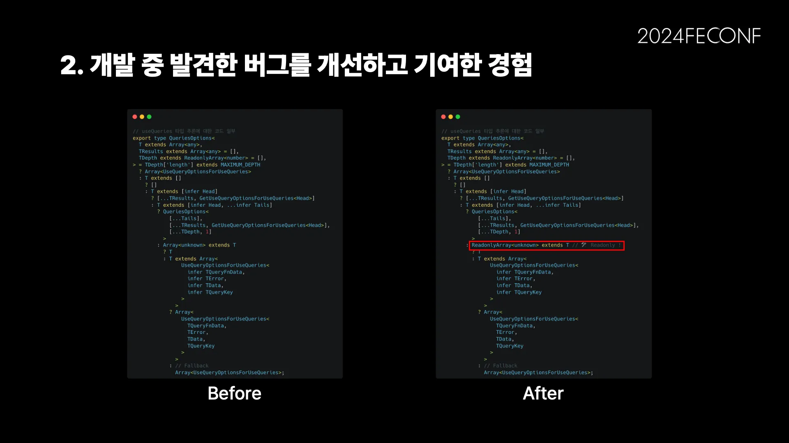

결과적으로는 단 한 줄 수정으로 이 버그를 개선할 수 있었어요. 돌아보면, 간단한 문제였지만, 그 과정에서 문제를 분석하고 필요한 정보를 모으는 과정이 얼마나 중요한지 깨달았어요.

# 오픈소스 기여로 성장한 점

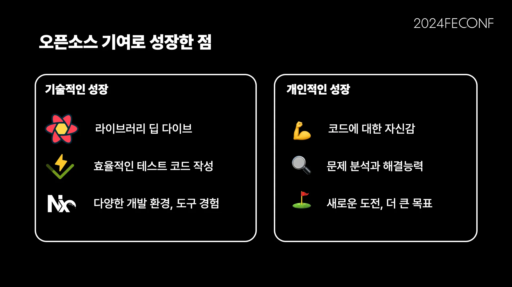

지금까지 오픈소스 기여 활동을 하면서 주변 분들에게 여러 질문을 받았어요. 그 중에서 제일 비중이 높은 질문은 “그래서 오픈소스 기여하면 얻는 게 뭔가요?”라는 질문이에요. 오픈소스 기여 활동을 통해 제가 얻은 기술적인 성장과 개인적인 성장을 이야기해보고자 해요.

## 기술적인 성장

오픈소스 기여의 가장 큰 장점 중 하나는 내가 기여한 라이브러리에 대해 깊이 있게 이해할 수 있다는 점입니다. 라이브러리의 문제를 해결하는 과정에서 자연스럽게 라이브러리의 매커니즘, 구조, 그리고 내부 동작 원리를 파악하게 됩니다. 이러한 경험은 단순히 해당 라이브러리를 사용하는 사용자에서 벗어나, 그것을 이해하고 개선할 수 있는 수준으로 기술 역량을 발전할 수 있어요.

다양한 기술을 간접적으로 경험할 수 있어요. 예를 들어, TanStack Query에 기여하면서 라이브러리의 내부 동작뿐만 아니라, 모노레포 아키텍쳐, 테스트 코드 작성, NX CI와 같은 다양한 개발 환경 및 도구들을 경험할 수 있었어요. 이러한 경험은 새로운 기술에 대한 이해도를 높이고, 다양한 도구와 환경에서 작업하는 경험을 할 수 있었어요.

## 개인적인 성장

오픈소스 기여를 통해 얻은 것은 기술적인 성장뿐만이 아니라 개인적으로도 많은 성장을 이뤘어요.

첫째로, **문제 해결 능력**이 크게 향상되었습니다. 오픈소스 프로젝트에서는 내가 해결해야 할 문제가 명확하지 않거나, 처음 접하는 복잡한 문제들이 많습니다. 이러한 문제들을 해결하는 과정에서 논리적 사고와 창의적인 접근 방법을 기르게 되었어요.

둘째로, **자신감**이 생겼습니다. 처음에는 내가 이 프로젝트에 기여할 수 있을까 하는 두려움이 있었지만, 작은 기여부터 시작하여 점차 더 큰 기여로 이어지는 과정을 통해 나도 중요한 부분을 개선할 수 있다는 자신감을 얻게 되었습니다. 이러한 자신감은 새로운 도전에 대한 두려움을 극복하고, 더 큰 목표를 설정하는 데 중요하게 작용했어요.

# 마치며

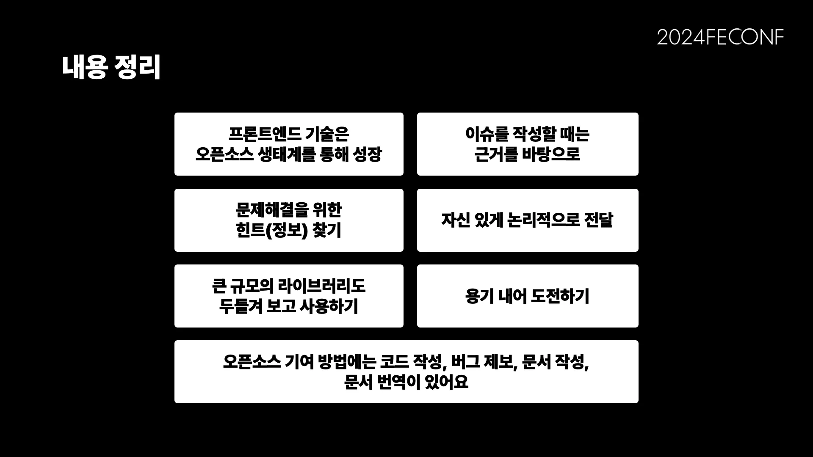

오픈소스에 기여하는 방법은 정말 다양해요. 단순히 버그를 개선하거나 코드를 리팩토링하는 것에 그치지 않고, 문서 작성, 오류 제보, 문서 번역 등 다양한 형태로 이루어질 수 있어요. 이러한 기여는 프로젝트의 기술적 향상뿐만 아니라, 커뮤니티 전체의 발전에도 큰 기여를 하게돼요.

개발 중에 발생하는 버그가 단순히 나의 실수라고 생각하기 쉬울 수 있지만, 때로는 사용하는 라이브러리 자체의 문제일 가능성도 있어요. 오픈소스 라이브러리에 대한 신뢰가 크다 보니, "내가 뭔가 잘못했겠지"라고 생각할 수 있지만, 때로는 라이브러리를 의심하고 검토해보는 단계도 필요하다고 생각해요.

## 오픈소스 기여에 대해 접근하는 방법

- 자신 있게 도전하기
- 해당 경험을 통해서 자신있게, 의견을 논리적으로 전달하고 도전하는 것
- 문제를 해결에 필요한 정보(힌트) 찾기

## 오픈소스 기여를 더 쉽고 재미있게 하는 방법

### 사용하고 있는 라이브러리에 기여하기

자신이 실제로 사용하는 오픈소스 라이브러리에 기여해보세요. 이미 그 라이브러리에 대한 배경 지식이 있기 때문에, 기여 활동이 더 쉽고 즐겁게 느껴질 것입니다. 특히, 자주 사용하는 기능이나 익숙한 영역에서 개선점을 찾는다면 더 큰 동기부여가 될 수 있어요.

### 작은 기여부터 시작해보기

기여는 반드시 큰 변화나 복잡한 코드 작성으로 이루어져야 하는 것이 아닙니다. 오타 수정, 링크 수정, 한국어 번역 등 문서에서 시작할 수 있는 작은 기여도 매우 중요해요. 또한, 테스트 코드 작성이나 개발 환경 개선과 같은 작업도 훌륭한 기여예요. 작은 기여는 첫걸음이 될 수 있으며, 점차 더 큰 역할로 이어질 수 있어요.

### 의심하지 않기

"사소한 기여인데 의미가 있을까?", "별것 아닌데 이런 기여가 필요할까?", "내 기여를 받아주지 않으면 어떡하지?" 등의 걱정은 하지 않아도 돼요. 오픈소스 커뮤니티에서는 작은 기여나 시도, 관심이 모두 소중하고 중요해요. 모든 기여는 환영받고, 누군가에게는 큰 도움이 될 수 있어요.

오픈소스 기여는 여러분도 지금 당장 시작할 수 있어요. 작은 기여라도 시작해 보는 건 어떨까요? 이를 통해 오픈소스 생태계에 기여함과 동시에, 자신을 성장시키는 소중한 경험을 쌓을 수 있을 거예요.

## 한국의 오픈소스 프로젝트

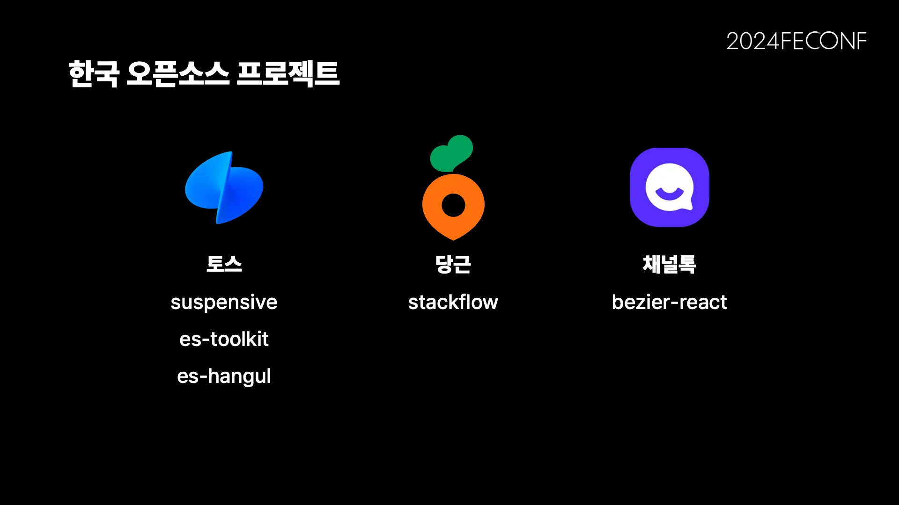

한국의 기업, 단체, 혹은 개인이 개발하고 있는 프론트엔드 오픈소스 프로젝트를 소개하고자 합니다. 이 프로젝트들은 현재 활발하게 개발 중이며, 오픈소스 기여를 적극적으로 수용하고 있습니다. 여러분도 쉽게 접근하고 도전해볼 수 있는 프로젝트입니다.
