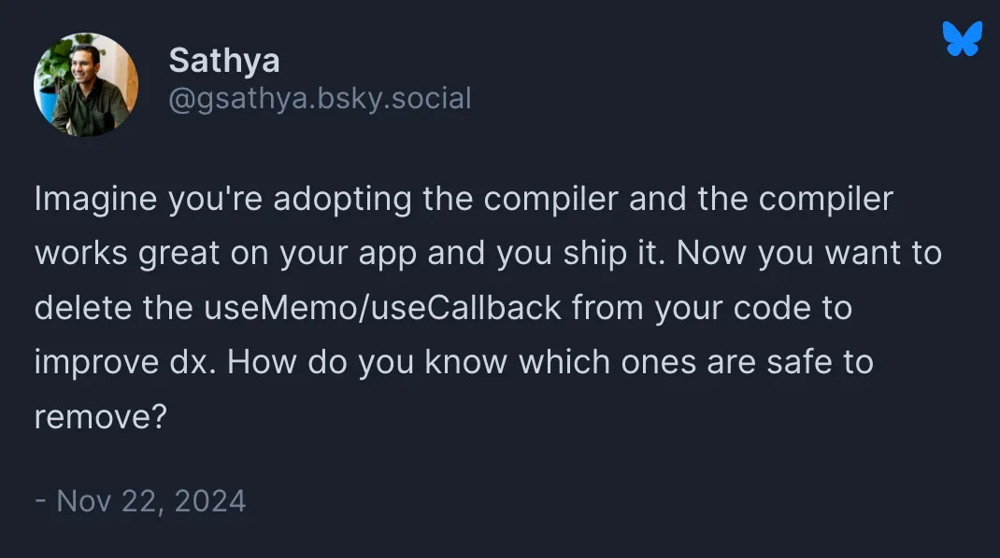

> TkDodo's blog의 [Ref Callbacks, React 19, and the Compiler](https://tkdodo.eu/blog/ref-callbacks-react-19-and-the-compiler)를 번역한 글입니다. 정확한 내용을 확인하려면 원문을 참고해주세요.


Photo by [Pavan Trikutam](https://unsplash.com/ko/@ptrikutam)

- [#1: Avoiding useEffect with callback refs](https://tkdodo.eu/blog/avoiding-use-effect-with-callback-refs)
- **#2: Ref Callbacks, React 19 and the Compiler**

제가 [callback ref](https://tkdodo.eu/blog/avoiding-use-effect-with-callback-refs)에 관한 첫 번째 글을 작성한 지 벌써 2년이 넘었습니다. 그 주제에 대해 다시 글을 쓸 거라고는 생각하지 못했지만, 시간이 지나면서 상황은 변했고 저 또한 그동안 몇 가지를 새로 배우게 되었습니다.

알고 보니, 제가 썼던 내용 중 일부는 100% 정확하지 않았고, React도 v19에서 변경된 점이 있어 이 주제를 다시 살펴보는 것이 좋겠다고 생각했습니다.

> 우리가 같은 맥락에서 이해할 수 있도록, 반드시 [#1: Avoiding useEffect with callback refs](https://tkdodo.eu/blog/avoiding-use-effect-with-callback-refs)을 읽어보시기 바랍니다.

제가 첫 번째 블로그 글에서 마음에 들지 않았던 두 가지가 있습니다:

1. 포커스 예제를 사용하고 있습니다. "그냥 autoFocus 속성을 사용하세요"라는 말을 많이 들었습니다. 예, 이는 노드로 수행할 수 있는 작업을 보여주는 예일 뿐입니다. 이제부터 이를 `node.scrollIntoView({ behavior: "smooth" })`로 바꾸겠습니다. 이는 중요한 변화는 아니지만 관계없이 언급할 필요가 있습니다.
2. `useCallback`을 해결책으로 너무 강조하고 있습니다. 이는 글의 핵심도 아니었고, 기술적으로도 정확하지 않았습니다. 이것은 중요한 변화이므로 잠시 이 점에 대해 집중해 보겠습니다.

# useCallback

저는 `useMemo`가 의존성 배열이 변경될 때만 계산이 실행된다는 것을 의미론적으로 보장하지 않는 이유에 대해 [블로그 글 전체](https://tkdodo.eu/blog/use-state-for-one-time-initializations)를 쓴 적이 있습니다. 그리고 `useCallback`은 `useMemo`의 변형일 뿐이므로 동일한 규칙이 적용됩니다. [react docs](https://react.dev/reference/react/useCallback#caveats)에서는 캐시된 결과가 렌더링 사이에서 임의로 버려지지 않겠지만, 여전히 `useCallback`을 단순히 성능 최적화를 위한 도구로만 취급해야 한다고 명확히 말하고 있습니다. 이는 `useCallback`을 제거하더라도 코드가 여전히 작동해야 한다는 뜻입니다. 이전만큼 효율적으로 동작하지는 않을 수 있지만, 작동이 멈추거나 충돌해서는 안 됩니다.

제 예제 중 하나가 이를 명백히 위반하고 있습니다:

```jsx
function CustomInput() {
  const ref = React.useCallback((node) => {
    node?.scrollIntoView({ behavior: 'smooth' });
  }, []);

  return <input ref={ref} defaultValue="Hello world" />;
}
```

여기서 우리의 의도가 `input`을 "마운트"할 때 해당 노드로 스크롤하는 것이라면, 우리는 이를 `useCallback`에 의존하고 있습니다. 일단 제거하면 매번 리-렌더링될 때마다 노드로 스크롤하게 될 것입니다. 이는 우리가 원하는 동작이 아닐 가능성이 큽니다.

더 나은 해결책은 이 함수를 `CustomInput` 컴포넌트 밖으로 이동하는 것입니다:

```jsx
function scrollIntoView(node) {
  node?.scrollIntoView({ behavior: 'smooth' });
}

function CustomInput() {
  return <input ref={scrollIntoView} defaultValue="Hello world" />;
}
```

이 방법은 `CustomInput`이 리-렌더링될 때 함수가 다시 생성되지 않으므로 우리의 의도를 완벽하게 반영합니다. 이는 단순히 노드와 관련된 작업을 수행하며, 해당 작업을 단 한 번만 실행하고자 할 때 매우 유용합니다.

<hr />

하지만 다른 예시에서처럼 DOM 노드를 측정하고 그 값을 상태에 저장하는 컴포넌트 내부의 무언가에 의존하기 때문에 컴포넌트 밖으로 옮길 수 없다면 어떻게 해야 할까요?

```jsx
function MeasureExample() {
  const [height, setHeight] = React.useState(0);

  const measuredRef = React.useCallback((node) => {
    if (node !== null) {
      setHeight(node.getBoundingClientRect().height);
    }
  }, []);

  return (
    <>
      <h1 ref={measuredRef}>Hello, world</h1>
      <h2>The above header is {Math.round(height)}px tall</h2>
    </>
  );
}
```

저는 이 예제가 여전히 완전히 괜찮다고 생각합니다. 왜냐하면 `useCallback`을 제거해도 코드가 동일하게 작동하기 때문입니다. 그 이유가 궁금하시다면, 다음과 같은 일이 일어나기 때문입니다:

- 첫 번째 렌더링에서는 React가 `h1`을 렌더링한 후 `measuredRef` 함수를 실행합니다.
- 그런 다음 새로운 값(e.g. 56)과 함께 `setHeight`를 호출하여 다시 렌더링을 트리거합니다.
- 그 렌더링에서는 다시 `measuredRef`를 호출합니다.(인라인 함수를 전달하면 렌더링마다 호출됩니다)
- 하지만 이번에는 `setHeight`가 동일한 값(56)을 전달받기 때문에 재렌더링을 건너뛰며, 이로써 체인이 멈춥니다.

따라서 동일한 값을 감지했을 때 재렌더링을 건너뛰는 `useState`의 깔끔한 최적화가 여기서는 유리하게 작동하지만, 매번 새로 생성된 객체를 상태에 저장하려고 하면 이 방식은 제대로 작동하지 않게 됩니다.

```jsx
function MeasureExample() {
  const [rect, setRect] = React.useState({ height: 0 })

  const measuredRef = (node) => {
    if (node !== null) {
      // 🚨 여기서 무한 리-렌더링이 발생됩니다. ⬇️
      setRect(node.getBoundingClientRect())
    }
  })

  return (
    <>
      <h1 ref={measuredRef}>Hello, world</h1>
      <h2>The above header is {Math.round(rect.height)}px tall</h2>
    </>
  )
}
```

이는 그다지 좋지 않습니다. 따라서 저는 기본 자료형을 저장하는 방식을 고수하거나, 정말 필요하다면 `useLayoutEffect`를 사용할 것입니다.

# React Compiler

그러한 경우에 useCallback을 사용하지 말아야 할 또 다른 이유는 곧 출시될 React 컴파일러입니다. 현재는 베타 버전이지만, 저는 React 컴파일러를 모든 코드베이스에서 사용하는 것이 당연한 미래가 올 것이라고 생각합니다. 우리의 코드가 작동하기 위해 반드시 필요한 `useCallback` 호출의 문제는, 어떤 것을 안전하게 제거할 수 있는지 알 수 없다는 점입니다. 컴파일러 작업에 참여 중인 [Sathya](https://bsky.app/profile/gsathya.bsky.social)가 이 점을 잘 설명했습니다:



이러한 사고방식은 이론적인 "React가 캐시된 결과를 폐기해서 내 앱이 망가질 수도 있다"를, 매우 현실적인 "내가 `useCallback` 호출을 제거해서 내 앱이 망가질 수도 있다"로 바꿉니다. 이는 제가 기대하는 것이 아닙니다.

# React 19

React 19에서 Ref callbacks이 업그레이드되어 이제 [cleanup 함수](https://react.dev/blog/2024/12/05/react-19#cleanup-functions-for-refs)를 반환할 수 있게 되었습니다. 이는 effect의 cleanup 함수와 동일한 방식으로 작동하며, 컴포넌트가 언마운트될 때 React가 이를 호출합니다. 이러한 경우 ref는 더 이상 `null`로 호출되지 않습니다.

이는 꽤 편리한 변화이며, 이제 ref 내부에서 정리가 필요한 작업을 수행할 수 있게 되었습니다. `getBoundingClientRect`를 사용해 DOM 노드를 측정하는 것은 [레이아웃 쓰래싱](https://gist.github.com/paulirish/5d52fb081b3570c81e3a)을 유발할 수 있고, 동적 크기 조정에도 업데이트되지 않기 때문에 사용하지 않을 수도 있습니다.

[ResizeObserver](https://developer.mozilla.org/en-US/docs/Web/API/ResizeObserver)는 이 두 가지 문제를 해결할 수 있으며, 이제 ref 콜백 내부에서 이를 생성하고 정리할 수 있습니다(사용하든 사용하지 않든):

```jsx
function MeasureExample() {
  const [height, setHeight] = React.useState(0);

  const measuredRef = (node) => {
    const observer = new ResizeObserver(([entry]) => {
      setHeight(entry.contentRect.height);
    });

    observer.observe(node);

    return () => {
      observer.disconnect();
    };
  };

  return (
    <>
      <h1 ref={measuredRef}>Hello, world</h1>
      <h2>The above header is {Math.round(height)}px tall</h2>
    </>
  );
}
```

# Ref Callback or useEffect?

cleanup 함수 덕분에 ref 콜백이 마치 새로운 `useEffect`처럼 보일 수 있습니다. 그래서 실제 질문은: 어떤 상황에서 어떤 해결책을 사용해야 할까요? 제 경험상 규칙은 다음과 같습니다:

- `node`에 접근이 필요하다면 ref 콜백을 선호합니다. 특히, 함수를 React 컴포넌트 외부로 추출할 수 있다면 더욱 그렇습니다. 이 방식은 여전히 `useRef` + `useEffect`보다 코드가 적으며, 제 첫 번째 글에서 언급했듯이 부모가 아닌 자식의 렌더링에 연결되므로 의도를 더 잘 전달합니다.
- 노드가 필요 없는 (실제) side-effect가 있다면(`document.title`에 값을 쓰는 것), 이를 ref에서 처리하지 않겠습니다. 이는 혼란을 야기할 뿐만 아니라, 효과를 무조건 "피하기" 위한 불필요한 단계로 보이기 때문입니다.
- 비동기 작업의 경우 둘 다 선택하지 말고 [Tanstack React Query](https://tanstack.com/query/latest)를 사용하세요.
